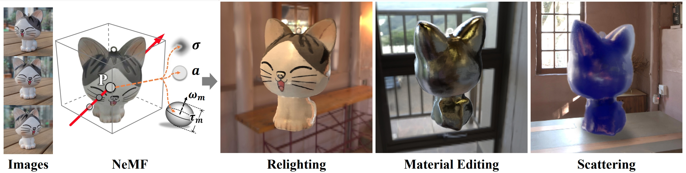

# Inverse Volume Rendering with Neural Microflake Field
### [Project Page](https://youjiazhang.github.io/NeMF/) | [Paper](https://arxiv.org/pdf/2304.00782)

<div align=center>

</div>

> [NeMF: Inverse Volume Rendering with Neural Microflake Field](https://arxiv.org/pdf/2304.00782)  
> Youjia Zhang, Teng Xu, Junqing Yu, Yuteng Ye, Junle Wang, Yanqing Jing, Jingyi Yu, Wei Yang.  
> ICCV 2023

## Installation

We have tested the code on pytorch 1.13.1, while a newer version of pytorch should also work.

```bash
conda create -n object_nerf python=3.8
conda activate object_nerf
conda install pytorch==1.13.1 torchvision cudatoolkit=11.3 -c pytorch -c conda-forge
pip install -r requirements.txt
```
## Data Preparation

Download `Synthetic4Relight.zip` from [here](https://drive.google.com/file/d/1wWWu7EaOxtVq8QNalgs6kDqsiAm7xsRh/view)


## Citation

```
@inproceedings{zhang2023nemf,
  title={Nemf: Inverse volume rendering with neural microflake field},
  author={Zhang, Youjia and Xu, Teng and Yu, Junqing and Ye, Yuteng and Jing, Yanqing and Wang, Junle and Yu, Jingyi and Yang, Wei},
  booktitle={Proceedings of the IEEE/CVF International Conference on Computer Vision},
  pages={22919--22929},
  year={2023}
}
```

## Contact

For feedback, questions, or press inquiries please contact [Youjia Zhang](Youjiazhang@hust.edu.cn).

Acknowledgements: part of our code is inherited from  [InvRender](https://github.com/zju3dv/InvRender/tree/main) and [NeRF](https://github.com/bmild/nerf).
